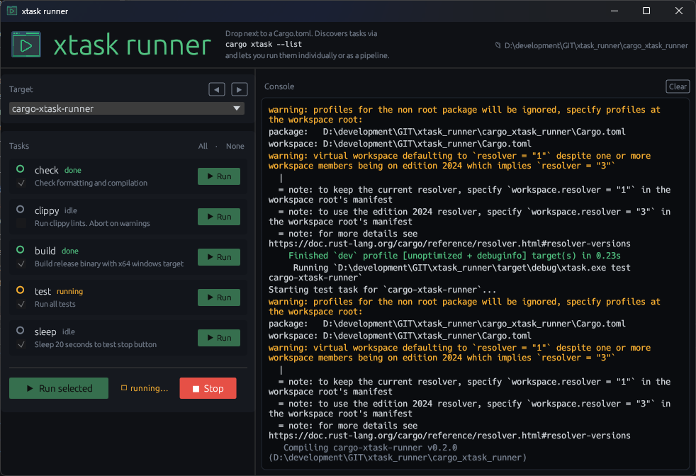
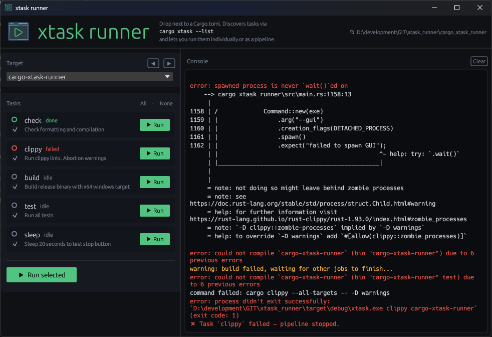
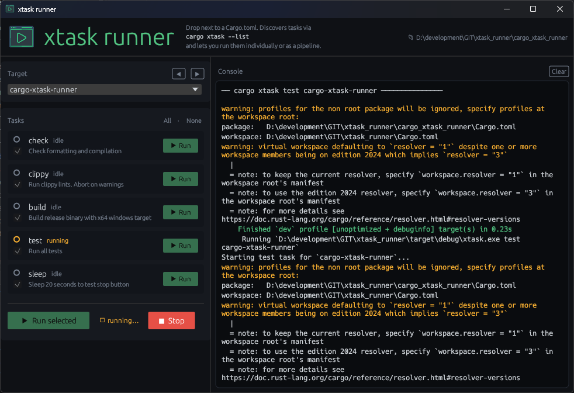
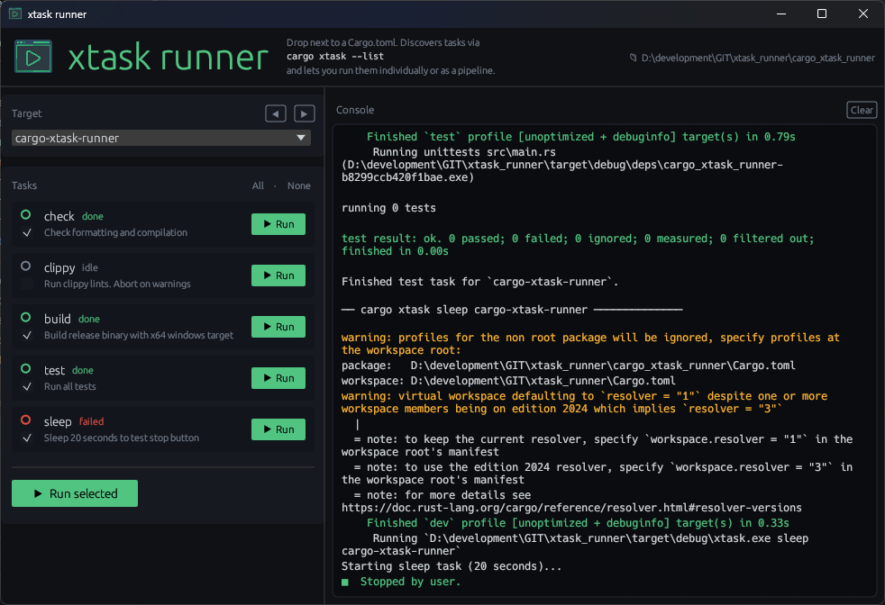

# cargo-xtask-runner

A GUI for [cargo xtask](https://github.com/matklad/cargo-xtask) workflows.



Instead of typing `cargo xtask <task> <target>` in the terminal, open a GUI that lists all your tasks, lets you check which ones to run, and streams the output to a built-in console - all without leaving your project or blocking the terminal

---

## Installation

```bash
cargo install cargo-xtask-runner
```

## Usage

Navigate to any Rust project that has an xtask runner and run:

```bash
cd my-rust-project
cargo xtask-runner
```

The GUI will open. The terminal is free to use for anything else while it runs.

## Requirements

Your project's xtask runner must support a `--list` flag that outputs tasks in this format:

```
target|task_id|description
```

For example:
```
workspace|fmt|Format all code
package|test|Run unit tests
package|build|Build release binary
```

Each line is one task. The `target` field groups tasks in the dropdown. Use `workspace` (or any other keyword) for tasks that apply globally and don't need a target argument.

### Example xtask `--list` implementation

```rust
// in xtask/src/main.rs
if args.contains(&"--list") {
    println!("workspace|fmt|Format all code");
    println!("workspace|clippy|Run clippy lints");
    println!("package|test|Run unit tests");
    println!("package|build|Build release binary");
    return;
}
```

## How it works

### Run all tasks via checkboxes.


### Aborts when an error occurs in ooder.



### Run individual tasks (test is running)



### Stop tasks at will.



## License

MIT — see [LICENSE](LICENSE)